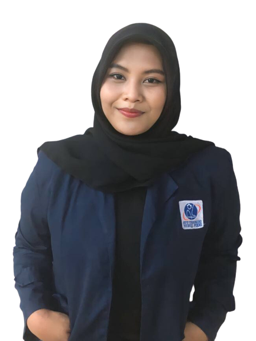
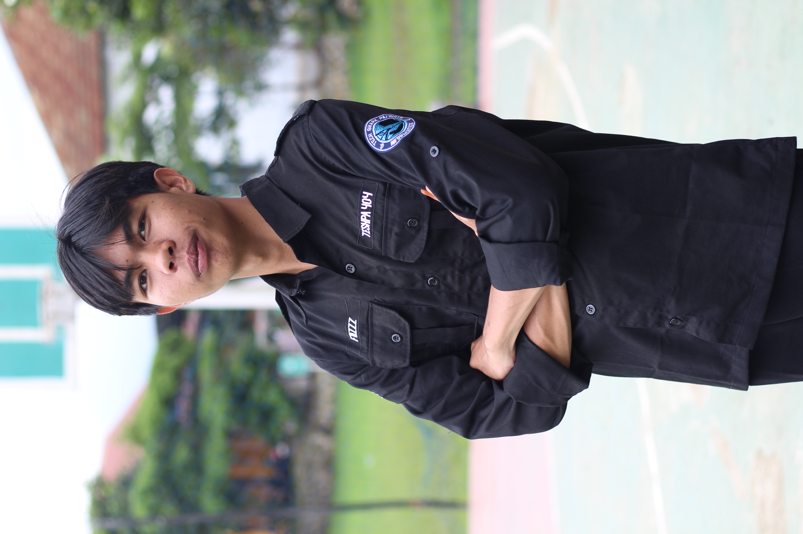

## **HIJO 4EVER**

<!-- kita akan menggunakan gambar (gambarnya akan saya buatkan dua kolom, jadi satu baris akan ada dua gambar masing-masing kecuali pm akan sendiri diatas) -->

<!-- masukkan gambar kalian difolder ./member-images -->

<table>
<!-- untuk project manager -->
  <tr>
    <td colspan="2" align="center">
      
       
      <strong>Nadya Mutia Safira</strong>
       
      <em>Project Manager</em>
    </td>
  </tr>
  <!-- tingkatan lead -->
  <tr>
    <td align="center">
      
       
      <strong>Romi Wahyudi Hasibuan</strong>
       
      <em>LeadOps</em>
    </td>
    <td align="center">
      
       
      <strong>Muhammad Shidqi Hanif Firdaus</strong>
       
      <em>LeadDev</em>
    </td>
  </tr>

  <!-- tingkatan dev -->
   <tr>
    <td align="center">
      
       
      <strong>Harun Yahya</strong>
       
      <em>LeadDev</em>
    </td>
    <td align="center">
      
       
      <strong>M. Hafiz Zalfa Al-Gifari</strong>
       
      <em>Security</em>
    </td>
  </tr>
</table>